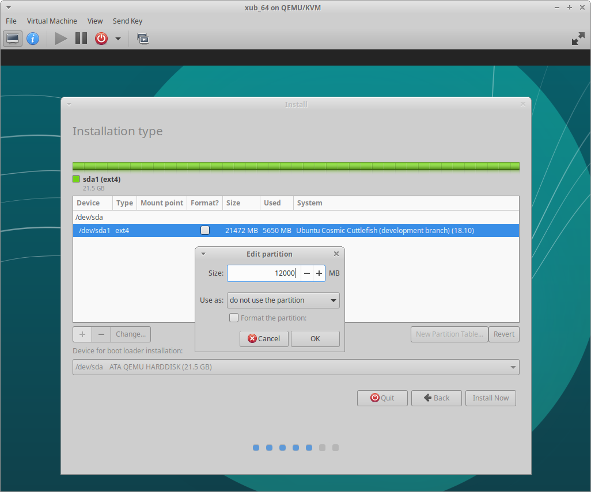
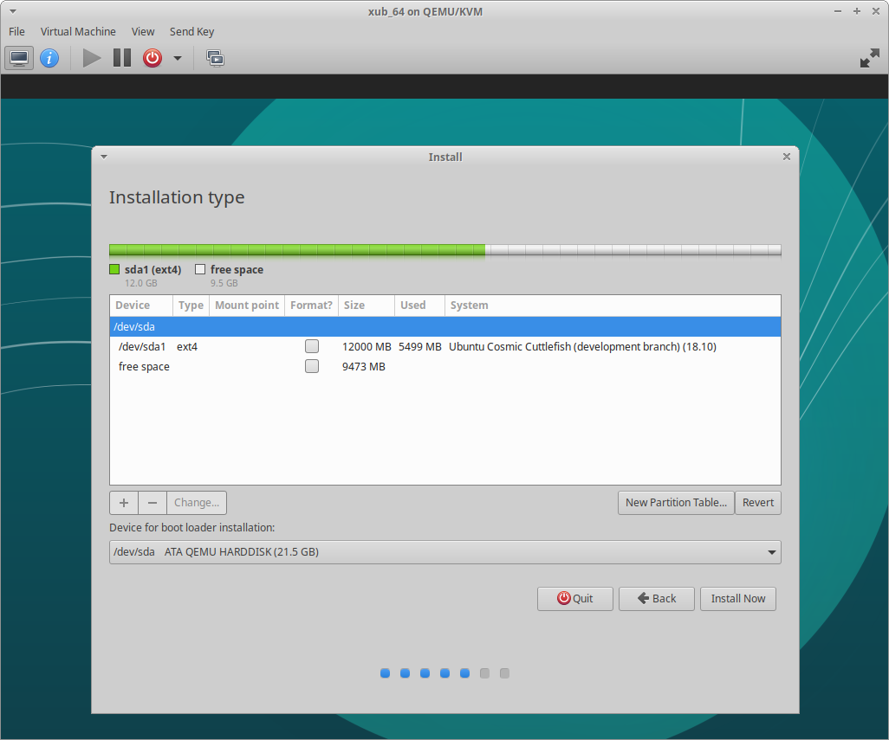
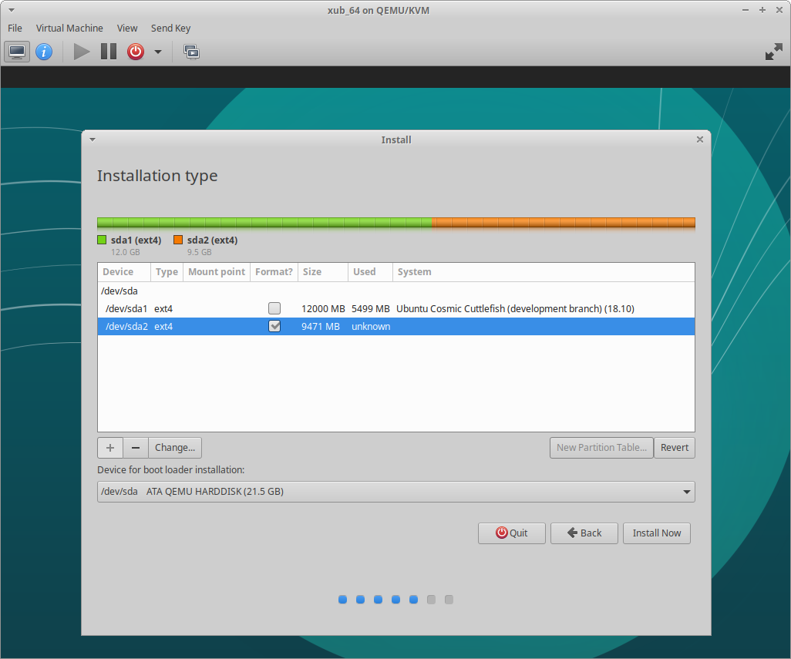
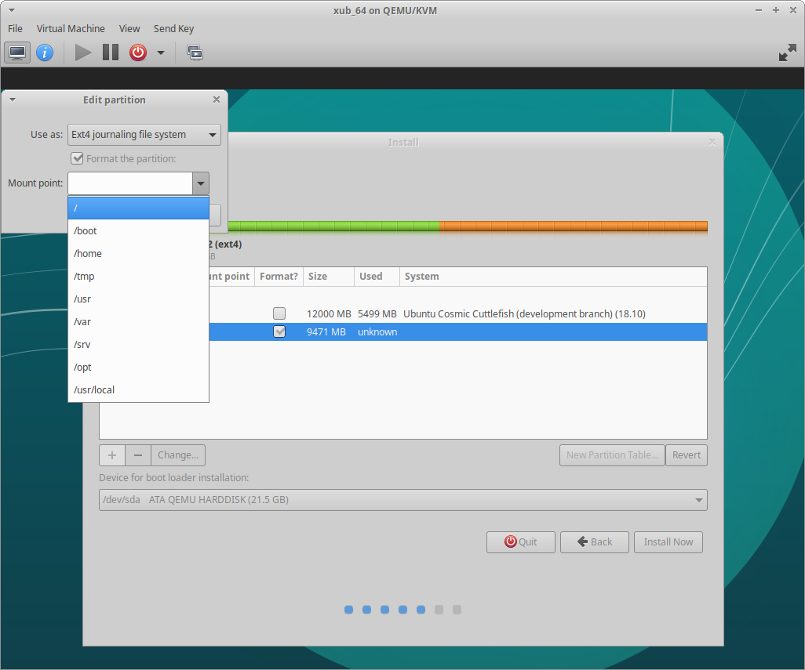
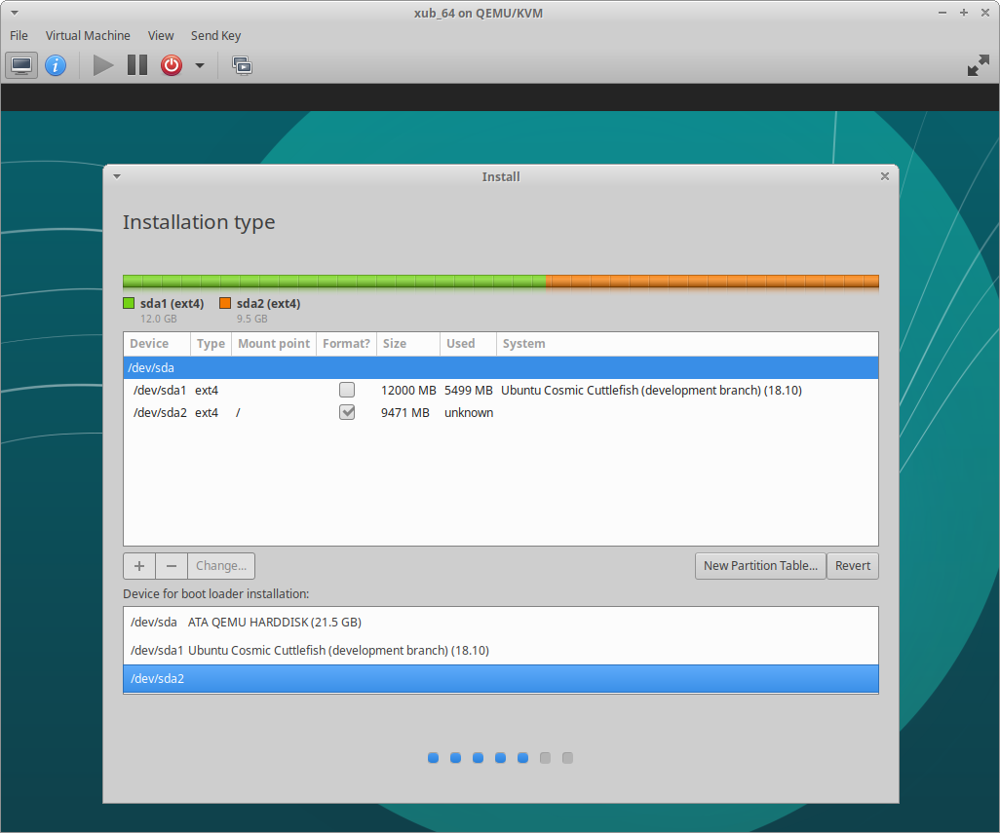
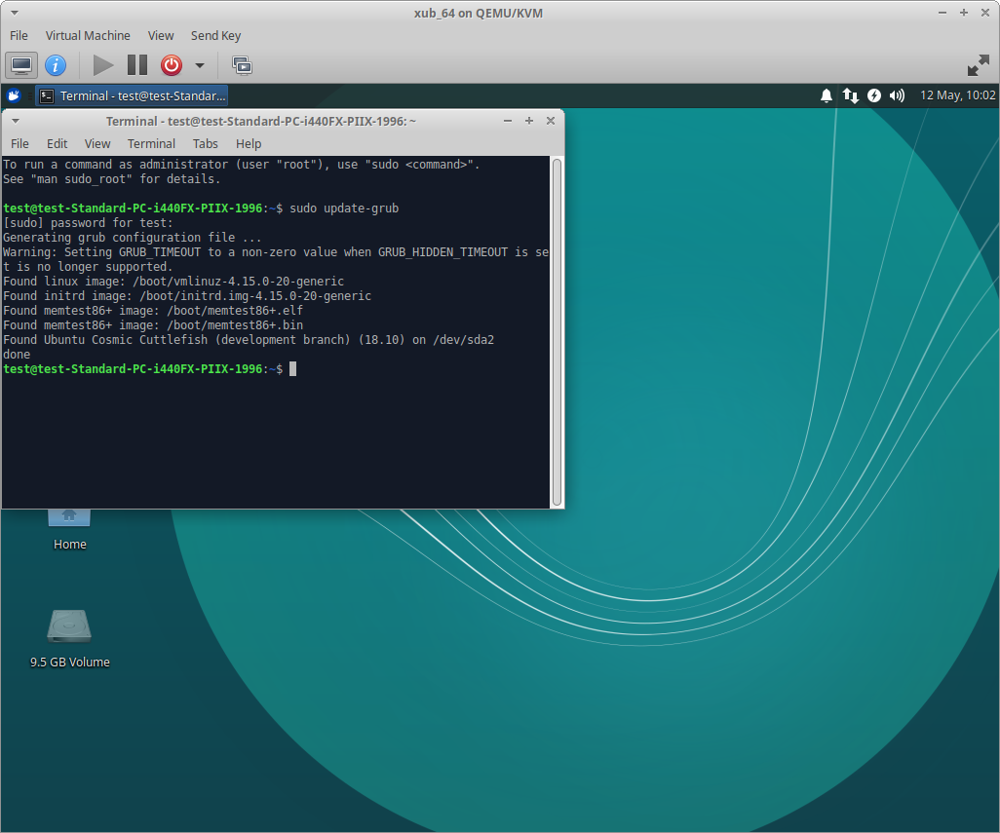
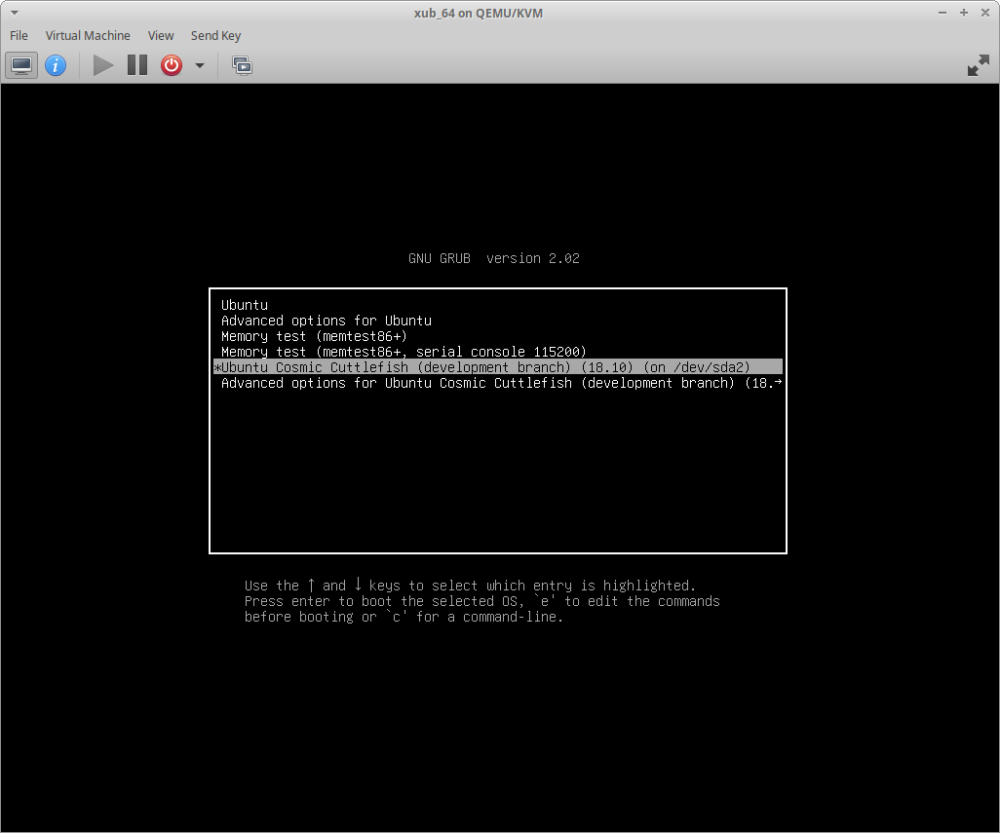

## Fine tuning your development setup

#### Using IRC for contact

If you do have questions regarding issues in a development version,
please do ask in the Xubuntu Developer channel (chat room)- don\'t worry
if you dont understand much of what is being discussed there - don\'t be
put off as the community is a friendly bunch and is always happy to see
more potential testers. Just ask your question and people will try to
help you.

You can access the channels most easily via the following links - just
choose a nickname (preferably one that\'s likely to be unique - and easy
to type!), the channel is already inserted for you (and ignore the Auth
to services box, unless you have already registered your chosen
nickname - see below)

      * If you want to talk to the developers choose [[http://webchat.freenode.net/?nick=Choose%20a%20nickname&channels=%23xubuntu-devel&prompt=1&uio=d4|#xubuntu-devel]]. For testing this is the one that you will almost certainly want to use

      * If you have a more general question, for example about an issue with a package that isn't from Xubuntu, or with network configuration etc,  then choose [[http://webchat.freenode.net/?nick=Choose%20a%20nickname&channels=%23ubuntu+1&prompt=1&uio=d4|#ubuntu+1]] 

      * For non-Xubuntu questions (e.g. about IRC!) or just to chat [[http://webchat.freenode.net/?nick=Choose%20a%20nickname&channels=%23xubuntu-offtopic&prompt=1&uio=d4|#xubuntu-offtopic]] 

With IRC you will miss messages when you are not logged on, but luckily
the latest
[Xubuntu-devel](https://irclogs.ubuntu.com/latest/%23xubuntu-devel.html)
and [Xubuntu Support](https://irclogs.ubuntu.com/latest/%23xubuntu.html)
channels are logged and updated every hour or so, and you can find older
ones here \[<https://irclogs.ubuntu.com/>\]. Similarly, other people
won\'t be in the channel all the time either - but if you say that
you\'ll check the weblogs later for an answer they will at least try to
get back to you even if when they come back you are not around.

Although it\'s not essential, it is a good idea to register your chosen
nickname for IRC, so that you can be guaranteed of allways having the
same recognisable identitybecause you can then use the same name across
sessions and accross the channels and people will be able to reckognize
you:

Just enter any IRC channel via one of the links above (Remembering to
choose a nickname!) and type, \'/msg NickServ REGISTER password
youremail@example.com\' substituting a password of your choice and your
email.

Then you will receive an email allowing you to register your chosen
nickname (as long as it isn\'t already taken).

You can also use an app for IRC, Hexchat (an Xchat fork) is popular with
Xubuntu people who can help you get up and running, there is a wiki page
for [Xchat](https://help.ubuntu.com/community/XChatHowto) which will
work for you to setup Hexchat.

#### Manual Partitions and Bootloader location

If you have more than one installation on your system, often the
autoresize option won\'t be available. Or you want control over where
your new install goes. Use the Something Else option and you will be
shown a list of disks and partitions on your system, with any
unallocated space shown as such.

You can create partitions or edit existing partition sizes until you
have a new partition available to install too.

The following runs through using the installer to create a new partition
and then install to it.

Once at the Something Else window, select the existing partition you
wish to resize and then the Change button - set the partition size you
wish to keep for this partition.

Now, select the resulting freespace

Press the + button to create your new partition

Now you can use the Change button to set the mount point for your new
installation.

Once you have done that you can continue with your installation using
your new partition.

In this scenario - grub (the bootloader) will be installed to the disk
from your new installation.

There are times when this is not what you want. If for instance you are
resizing your main install and want that to keep control of your
bootloader.

This can be done by changing the bootloader device.

Press `Device for bootloader installation` and a drop down will appear
showing your available partitions. Choose the device which corresponds
to the installation, in this example /dev/sda2 and then continue the
installation

Once the installation has finished you can reboot as is normal, however
in this case there is no way yet to boot into your new installation as
your main bootloader doesn\'t know about it yet.

Login to your main installation, open a terminal and run this command
(this updates Grub and finds all systems it can boot)

`sudo update-grub`

Reboot the machine again and your new installation will now be available
in Grub.

#### Adding an ISO to Grub

Sometimes you might find it easier to have the development ISO available
as an option in your Grub menu.

This will work just like booting the ISO on a USB except all you can do
is run the live session - on your hardware - without being able to
install it.

To do this you need to copy your ISO somewhere that it can be found by
grub.

The following are examples of the setup a member of the QA Team uses.

They keep their ISO in /boot/grubiso - a folder they created for this
purpose.

To allow for the functionality, you need to edit a system file -
/etc/grub.d/40_custom. To edit the file, Alt+F2 then use this command to
edit the file as root `pkexec mousepad /etc/grub.d/40_custom`

It is important that the default top lines of this file are not changed.

The following content works for the QA member because, the location of
the ISO file (grubiso) and the hard drive setting (hd0,5) are correct
for them. You need to input your ISO location and hd setting. The
remaining parts should then work for you.

They have 2 options available on their grub menu, one boots the ISO
directly, the second loads the ISO into RAM and then boots from there.

    menuentry "Cosmic Cuttlefish 64" {
          set isofile="/boot/grubiso/xubuntu-cosmic-desktop-amd64.iso"
          loopback loop (hd0,5)$isofile
          linux (loop)/casper/vmlinuz.efi boot=casper iso-scan/filename=$isofile noprompt noswap noeject
          initrd (loop)/casper/initrd.lz
    }

    menuentry "Cosmic Cuttlefish 64 ram" {
          set isofile="/boot/grubiso/xubuntu-cosmic-desktop-amd64.iso"
          loopback loop (hd0,5)$isofile
          linux (loop)/casper/vmlinuz.efi toram maybe-ubiquity boot=casper iso-scan/filename=$isofile noprompt noswap noeject
          initrd (loop)/casper/initrd.lz
    }

Once the file has been edited and saved, you must update grub to include
your new ISO options, `sudo update-grub`, when you reboot you should now
see them on your Grub menu

#### QA Team Contributor Information

Further, more detailed, information can be found at the Xubuntu Team\'s
[Contributor Documentation](https://docs.xubuntu.org/contributors/),
Chapter 4 of which is specifically about the Xubuntu QA Team.
