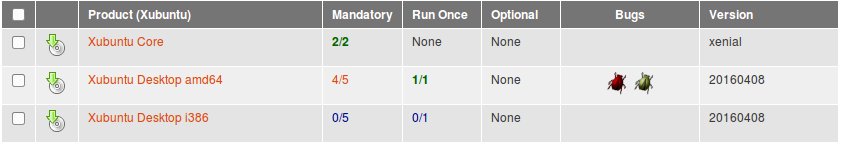
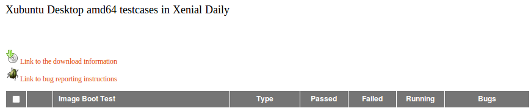
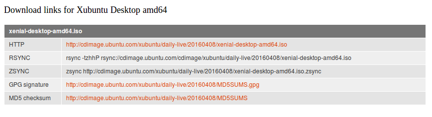
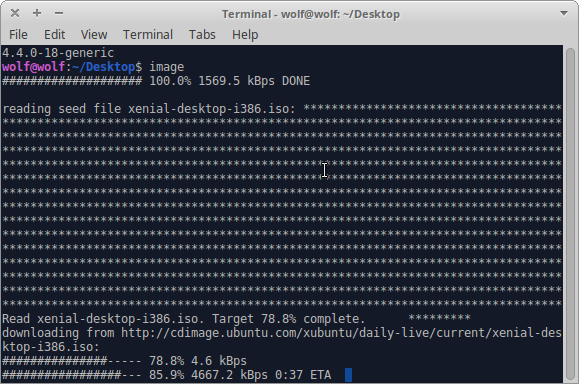
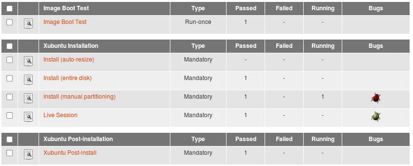
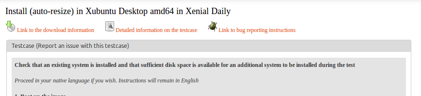
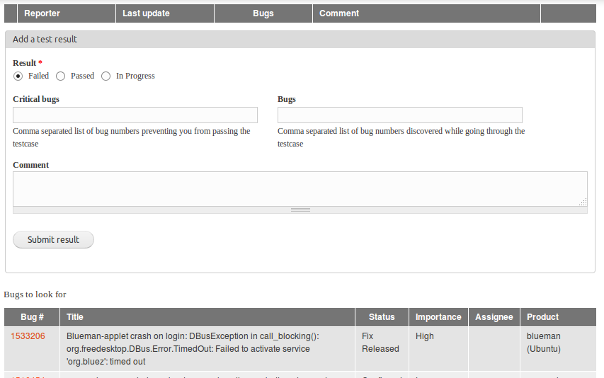

## ISO Testing

### ISO Test Builds

Test builds available for testing are listed on the ISO
[tracker](http://iso.qa.ubuntu.com/), you can decide which of the
available iso\'s you will test.

This page will look similar to this

After you have selected an architecture, you will see links at the top,
select the Download information link

You will now see all the download possibilities available to you, choose
which suits you and download your iso for testing.

If you are going to be regularly testing the iso, you might look at
using [Zsync](https://help.ubuntu.com/community/ZsyncCdImage) to only
download differences between your local copy and the released daily
image.

This can make some difference in the amount to download, particularly
useful if your speed is slow, spotty or you have download limits.

### Test Instructions

Once you have your iso, you can burn this to media or use a virtual
machine to boot the iso. Once you are in a position to boot the iso, you
will want to choose which testcase to run

Selecting one of the testcases will show you a page with some links at
the top, followed by the testcase to follow

Follow the testcase text to the end, noting issues that you have seen.

### Submitting Results

Once you have completed the testcase you are in a position to report
your result on the tracker, you will see this section of the tracker
page directly following the testcase detail

If you have noted bugs during the testcase you have 2 options:

Critical bugs: These are bugs which cause you to not pass the testcase.
For example - you start the installer but are unable to complete. Mark
your test as Failed.^1^

Bugs: These are bugs discovered during the test, which don\'t affect the
testcase. For example, an application not part of the test, crashes and
you see the crash dialogue.

Below the Submit button, you will see a list of bugs that other
reporters have noted during the *same test and milestone* - regardless
of when, a bug in a daily test could have been reported at the cycle
start.

### Notes

^1^ You might find that your result gets edited, while there could be
many reasons for this, it\'s possible that Xubuntu QA have un-failed
your result, sometimes there is a fine line between a fail and pass and
we might allow an issue under particular circumstances.
