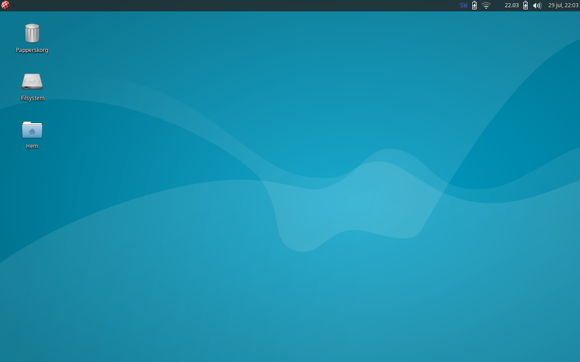
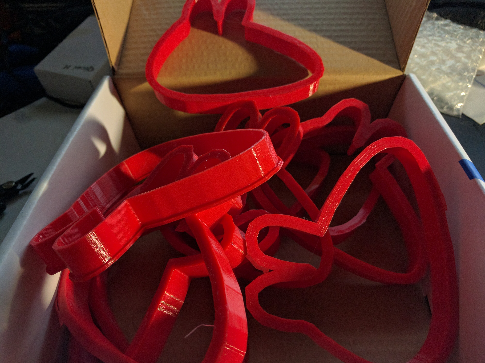
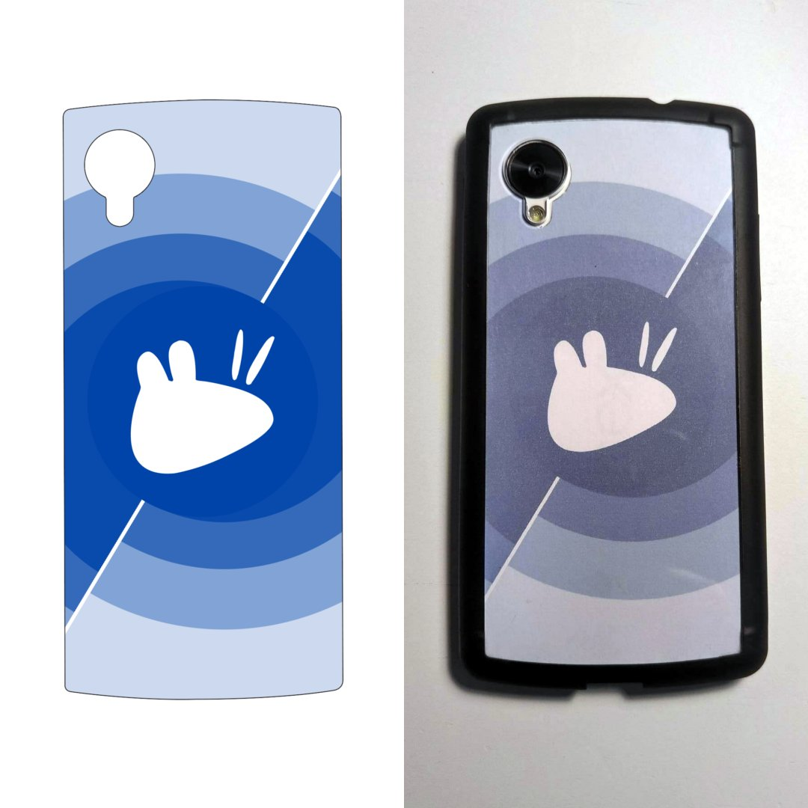
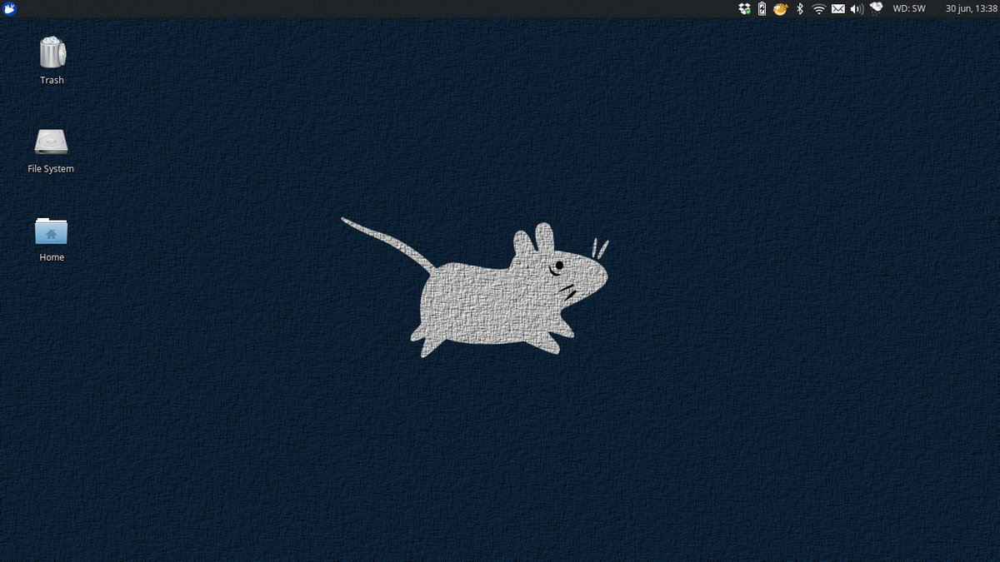
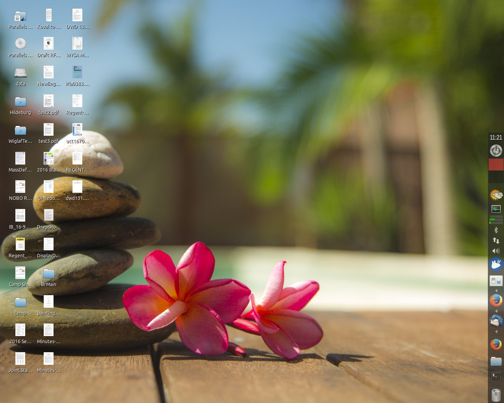
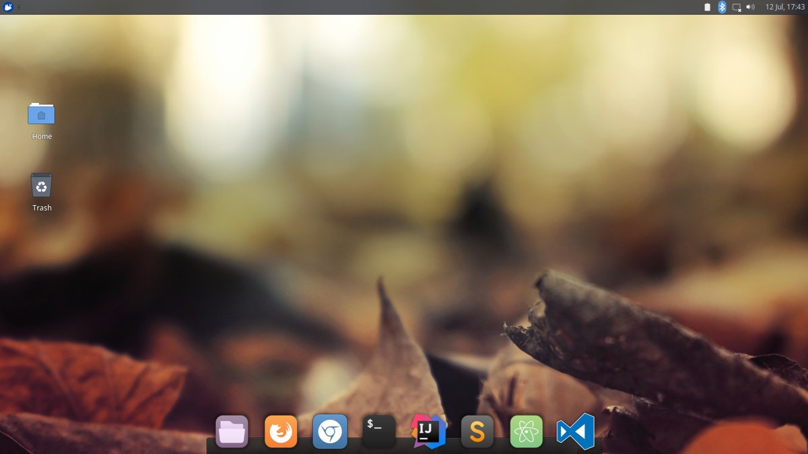
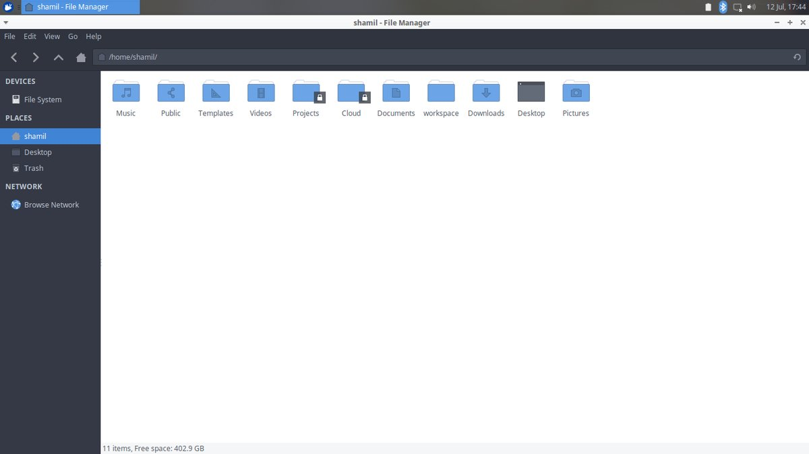
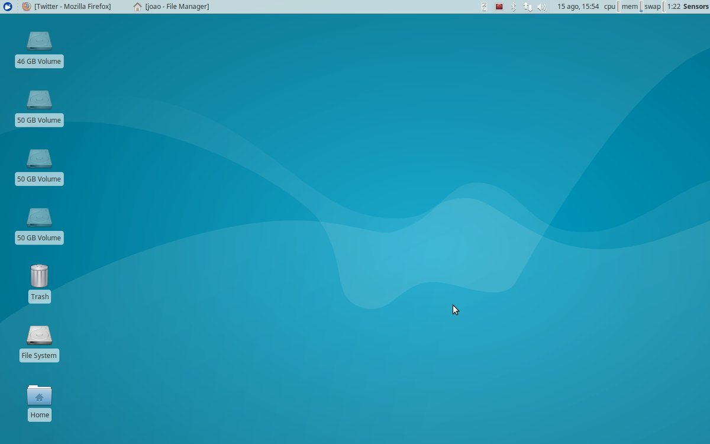
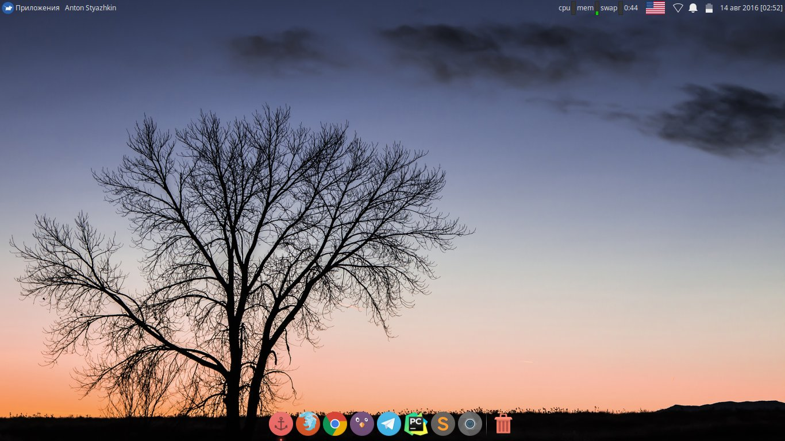
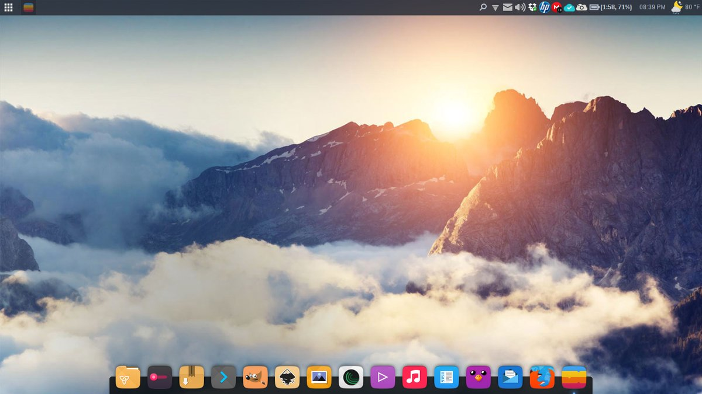

# Love Xubuntu 2016

The following are stories collected during the 2016 Love Xubuntu
campaign.

## Federico Airola

The conversation is between me and one of my University mates. We are
both Xubuntu users and also programmers.

We are Italian and so the screen is in Italian, sorry for the
inconvenience. But I\'m going to tell you the story and translate the
messages in the screen.

Here in Italy now it\'s exams-time. We, as programmers, were also
working on two different projects, and were talking about them.

Me (green): \"Also you had to pause your work?\"

He (white): -sends a photo in which shows that his project\'s folder is
locked-

He: \"I had to change folder\'s user and give it to root; and then
revoke permissions to myself\" (he did this to remain focused on
studying for the exams)

Me: -laughing-

Me: \"This was funny!\"

Source:
<https://lists.ubuntu.com/mailman/private/xubuntu-contacts/2016-June/000048.html>
(private archive)

## Willem Hobers

My mother in law is 81. She\'s half deaf and her eyesight is getting
worse and worse. She couldn\'t properly use her old Windows XP computer
anymore. So, I took Xubuntu, stripped it down to the bear necessities
for her (mail, internet, solitaire), and one task bar button (shutdown),
and made the icons and font as large as is possible and still usable,
and tried to make it look like her XP-theme. I even found that it was
possible to make the scroll bar in the windows really wide.

She\'s now a happy xubuntu user. She likes the large font, the large
icons and the clear colours.

Source:
<https://lists.ubuntu.com/mailman/private/xubuntu-contacts/2016-June/000049.html>
(private archive)

## Dina Goldin

I live in Israel, and in Hebrew, the slang word \"Zubi\" is an insolent
and extreme way to say \"No way I\'ll do it\".

Also, according to the Hebrew Wikipedia, Xubuntu is pronounced as
\"Zoo-boon-too\" rather than \"Ksoo-boon-too\" (its name is written in
Hebrew, which solves that ambiguity).

Therefore, when I told a friend that my old computer would not boot
because of a hard disk problem, and all the technicians advised me to
buy a new one, but I installed Xubuntu and it works, he noted that
\"Xubuntu\" actually sounds like \"I\'m not doing that, I\'m moving to
Linux!\"

Source:
<https://lists.ubuntu.com/mailman/private/xubuntu-contacts/2016-July/000050.html>
(private archive, see thread)

## Carl Vernersson

Reminded me of a modern version of my beloved Workbench 1.3 on my Amiga
500 which unfortunately doesn\'t work anymore. The blue wallpaper, the
taskbar on top and the icon appearing on my desktop when inserting a SD
card, loved it.

Seriously, that was my first thought when I installed Xubuntu for the
first time yesterday.

With this in mind, Carl made an adjustment to the Xubuntu desktop and
replaced the Xubuntu mouse logo with the Amiga Boing Ball!

Source:
<https://lists.ubuntu.com/mailman/private/xubuntu-contacts/2016-July/000055.html>
(private archive)

## Dan Juarez

I started my computing days in 1986 with my first computer, an Apple
IIe. From there I went on to use an IBM XT system with DOS. Then later I
used GeoWorks Ensemble and then Windows 3.1 through Windows XP. From
2004 to 2015 I used a Mac and Apple\'s OS X. I use Windows 7 but only
for work on my employer\'s laptop.

In 2015 I sold my MacBook Pro and built my own PC (something I had done
in the past but had not done in many years). I decided I was switching
to Linux. I tried various distros but ended up sticking with Xubuntu. It
has allowed me the customization that I could not get from Apple - you
take what they give you and that\'s it. I was tired of the direction
they were going with their OS and wanted control of my system back.
That\'s why I chose Xubuntu as it gave me the most control over the look
and feel of the operating system. And I can change that look as often as
I want.

I am thankful for the talented developers and other contributors that
keep Xubuntu going. Thanks for all you do!

Source:
<https://lists.ubuntu.com/mailman/private/xubuntu-contacts/2016-August/000059.html>
(private archive)

## Robert Streeter (#1)

I started my Linux journey about 12 years ago by using Ubuntu and used
Ubuntu for quite a while until I came across a variant called Xubuntu
and I immediately fell for this distro. I have created many awesome
moments with Xubuntu it gets out of my way and lets me get all my
everyday tasks done and done right. I follow Xubuntu and some of its
team members just so I can keep up to date with all that is new and
upcoming. I run a computer business and I always recommend Xubuntu to
all of my customers no matter if they have super extreme hardware, I
always tell them that it is the operating system that just lets you get
things done.

I have installed Xubuntu on all my computers at home and I love it, I
always get a chuckle when my wife is running her computer and it runs MS
Windows and it seems to nag her about everything, and my systems do not
they just let me do what I want when I want.

So I thank all of you for your hard work, hope to see what great things
you all come up with in the future.

Source:
<https://lists.ubuntu.com/mailman/private/xubuntu-contacts/2016-August/000060.html>
(private archive)

## Daniel Eriksson

We run a small business, mainly doing computer service and maintenance,
app programming and other similar things. One of the things we do are
customized Linux desktops, where we build a user interface based around
a customers wishes; tweaking everything from themes, colors and fonts to
panels, widgets and other content. When we started doing this we tried
out and evaluated loads of distributions and desktop environments,
eventually deciding that Xubuntu was the perfect choice. We wanted to
maximize the amount of customization we could do while still having a
system that was light on resources (since customers often have old
computers.)

It was a choice we have never regretted, as it has always fit our needs
perfectly. We can get everything from design to workflow just as we want
it, and it is stable as rock while still often introducing new features
for us to play with.

One of our best experiences was with a person who wanted an interface on
a laptop that was just as simple and scaled down as that of an iPad,
while still being able to do all things a computer ought to do. This was
not an especially computer-savvy person, so it needed to be
straightforward and simple. We managed to discard most classic desktop
parameters and build a very unique interface, all within what was
provided by stock Xubuntu. (Though we did some art ourselves.) It turned
out great, our customer was very happy with it and other people have
shown interest in having something similar on their computers. Needless
to say, this was a success story for us which had not been possible
without Xubuntu.

So thanks for all your hard work! We keep on designing our users
desktops and will continue to use the excellent Xubuntu for it. :)

Source:
<https://lists.ubuntu.com/mailman/private/xubuntu-contacts/2016-September/000064.html>
(private archive)

## Keith I Myers

After seeing a simple metal cookie cutter created by the Xubuntu
Marketing lead, Keith was inspired to make a plastic 3D-printed version
of the Xubuntu cookie cutter. He printed several of them and also shared
the design on Thingiverse so others could also print it.

-   Initial printing of the cookie cutters:
    <https://plus.google.com/+KeithIMyers/posts/YCwxjuxJKYE>
-   A box of several he printed:
    <https://plus.google.com/+KeithIMyers/posts/JYUxKptzf2t>
-   Design on Thingiverse: <http://www.thingiverse.com/thing:1642573>

Source: see links above

## Sean Davis

How about a \@Xubuntu template for your Nexus 5 and Ringke Fusion case?
#LoveXubuntu How about a \@Xubuntu template for your Nexus 5 and Ringke
Fusion case? #LoveXubuntu

Source: <https://twitter.com/bluesabredavis/status/746721807156252672>

## Aaron Raimist

I converted another one! #LoveXubuntu \@Xubuntu

> RT: Jordan Zimmerman \@jzestaaqui
>
> my (windows 10 smh) computer went kaput, and I went through a crazy
> journey for a day to get Linux - thanks \@aaronraimist and
> \@SwagBelgian

Source: <https://twitter.com/aaronraimist/status/748696174455033857>

## Jan Jansen

Im in #LoveXubuntu for two years now! Use it as my only OS on my T420.
it works beautifully and i think it will do that a while longer :)

Source: <https://twitter.com/two_jays/status/746811720786665473>

## jugem

Happy　birthday Xubuntu!!! #LoveXubuntu

Source: <https://twitter.com/garege_junya/status/747067891489505280>

## Koos Plegt

Happy 10th birthday for my favourite #Linux distro! Here\'s a screenshot
of my #Xubuntu 16.04 setup #LoveXubuntu

Source: <https://twitter.com/KoosPlegt/status/748482280780369920>

## Victor Forberger

#LoveXubuntu \@Xubuntu 14.04 screenshot today. Been with #xubuntu since
08.10.

Source: <https://twitter.com/vforberger/status/749277753564803072>

## Michael Morozov

I #LoveXubuntu because it\'s top-notch, minimalistic neat and helps me
focus on real things.

Source: <https://twitter.com/m1xo_0n/status/752853361641357312>

## Shamil

Happy 10th Anniversary to \@Xubuntu A look at my system - #Xubuntu 16.04
with Plank dock, Arc-Theme #LoveXubuntu

Source: <https://twitter.com/shamilchoudhury/status/752841588800356352>

## João MC Texeira (#1)

#LoveXubuntu! I wrote PhD Thesis in Portugal and now PostDoc at
\@UniBarcelona also using \@Xubuntu. Almost 10 years with u! Keep on
fellows!!

Source: <https://twitter.com/joaomcteixeira/status/753164016030285826>

## Adam Brodziak

In 2007 I\'ve polished my XFCE, slick grey theme, minimalistic icons,
gmusicbrowser. Then #Xubuntu came out and #LoveXubuntu from first sight

Source: <https://twitter.com/AdamBrodziak/status/752976583237984256>

## Krist Dylst

Upgrading to #xubuntu 16.04. Thank you Wily Werewolf, you have served me
well. #LoveXubuntu

Source: <https://twitter.com/ubuntukadee/status/758582066183282688>

## Víctor Sánchez

Loving \@Xubuntu since 12.04. The perfect distro for getting work done.
Fast and stable, I\'ve finished mi PhD with you. #LoveXubuntu

Source: <https://twitter.com/victor_sanchezm/status/763837020212957185>

## Sabrin Islam

\@Xubuntu A teacher once asked me, \"how did you get windows to look
like that\" , to which I replied it\'s xubuntu sir #LoveXubuntu

Source: <https://twitter.com/Ornim/status/764006924811546624>

## João MC Teixeira (#2)

Fresh installed and ready for the next two years! \@Xubuntu 16.04 -
#LoveXubuntu

Source: <https://twitter.com/joaomcteixeira/status/765188517639155712>

## BstMnFall

I have been using Xubuntu on 3+ home computers for over 8 years. From
time to time I explore elsewhere, but always come back. #LoveXubuntu

Source: <https://twitter.com/BstMnFall/status/763907159855890433>

## Anton Styazhkin

Thank you for being there \<3 #LoveXubuntu #Xubuntu #Linux #Desktop

Source: <https://twitter.com/untonyst/status/764620728171917312>

## Robert Streeter (#2)

#LoveXubuntu You all rock with this rock solid Distro

Source: <https://twitter.com/Hacker_Planet/status/765645078471725057>
