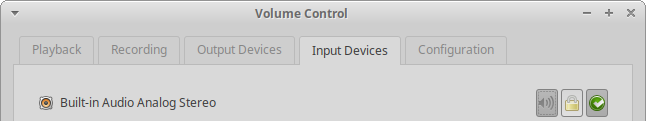

# Xubuntu 18.10 Release Notes

## DRAFT:SUBJECT TO CHANGE

## Notable Issues

### Installer Issues

    ***It must be noted that it is close to impossible for our small team of testers to be in a position to work through all the varying parameters available during installation. We do however aim to test all the possible methods of installation (including for OEM and using encryption) available either on a virtual machine or on hardware (where hardware has been used during testing then Xubuntu QA will where possible make that known on the iso testing tracker). Further installation testing information can be on the Ubuntu installation release note(s) listed below**

-    No restart after installation
    ([1723760](https://bugs.launchpad.net/ubuntu/+source/casper/+bug/1723760))

### General Issues

-   Network indicators
    -   Currently at times the panel could show 2 network icons, this
        appears to be a race condition which we have not been able to
        rectify in time for release.

```{=html}
<!-- -->
```
-   Parole Media Player: Play button inactive
    ([1705243](https://bugs.launchpad.net/parole/+bug/1705243))
-   Applications Menu plugin clips panel icon
    ([1756608](https://bugs.launchpad.net/ubuntu/+source/xfce4-panel/+bug/1756608))
-   Launch and Directory Menu items icons are too small
    ([1756612](https://bugs.launchpad.net/ubuntu/+source/xfce4-panel/+bug/1756612))

#### Ubuntu Generic Release Note

The main Ubuntu release
[note](https://wiki.ubuntu.com/CosmicCuttlefish/ReleaseNotes) covers
both many of the other packages we carry and more generic issues.

## Major Updates

### Appearance

#### elementary Xfce Icon Theme 0.13

The latest version of our icon theme includes the manila folder icons as
seen in the upstream elementary icon theme. Additionally, our icon theme
is now optimized with optipng, meaning a smaller install size and
potentially improved load times.


#### Greybird 3.22.9

The latest Greybird release improves the look and feel of our window
manager, alt-tab dialog, Chromium, and even pavucontrol! The notebook
styles look significantly better and consistent with our other
applications.



### Xfce

#### Applications

-   Mousepad 0.4.1
-   Ristretto 0.8.3
-   Thunar 1.8.1 *(New GTK+ 3 release!)*
-   Xfce Desktop 4.13.2 *(New GTK+ 3 release!)*
-   Xfce Dictionary 0.8.1
-   Xfce Panel 4.13.3 *(New GTK+ 3 release!)*
-   Xfce Screenshooter 1.9.3 *(New GTK+ 3 release!)*
-   Xfce Settings 4.13.4 *(New GTK+ 3 release!)*
-   Xfce Task Manager 1.2.1
-   Xfce Terminal 0.8.7.4

#### Libraries

-   Exo 0.12.2
-   libxfce4util 4.13.2
-   Tumbler 0.2.3
-   Xfconf 4.13.5

#### Panel Plugins

-   Xfce Verve Plugin 2.0.0
-   Xfce Whisker Menu Plugin 2.2.1

#### Thunar Plugins

-   Thunar Archive Plugin 0.4.0
-   Thunar Media Tags Plugin 0.3.0

## Changelogs

### Xubuntu/Other Packages

-   blueman
    ([changelog](https://launchpad.net/ubuntu/cosmic/+source/blueman/+changelog))
-   elementary-xfce
    ([changelog](https://launchpad.net/ubuntu/cosmic/+source/elementary-xfce/+changelog))
-   gtk2-engines-xfce
    ([changelog](https://launchpad.net/ubuntu/cosmic/+source/gtk2-engines-xfce/+changelog))
-   lightdm-gtk-greeter
    ([changelog](https://launchpad.net/ubuntu/cosmic/+source/lightdm-gtk-greeter/+changelog))
-   lightdm-gtk-greeter-settings
    ([changelog](https://launchpad.net/ubuntu/cosmic/+source/lightdm-gtk-greeter-settings/+changelog))
-   menulibre
    ([changelog](https://launchpad.net/ubuntu/cosmic/+source/menulibre/+changelog))
-   mugshot
    ([changelog](https://launchpad.net/ubuntu/cosmic/+source/mugshot/+changelog))
-   pavucontrol
    ([changelog](https://launchpad.net/ubuntu/cosmic/+source/pavucontrol/+changelog))
-   sgt-launcher
    ([changelog](https://launchpad.net/ubuntu/cosmic/+source/sgt-launcher/+changelog))
-   shimmer-themes
    ([changelog](https://launchpad.net/ubuntu/cosmic/+source/shimmer-themes/+changelog))
-   xfpanel-switch
    ([changelog](https://launchpad.net/ubuntu/cosmic/+source/xfpanel-switch/+changelog))
-   xubuntu-artwork
    ([changelog](https://launchpad.net/ubuntu/cosmic/+source/xubuntu-artwork/+changelog))
-   xubuntu-core
    ([changelog](https://launchpad.net/ubuntu/cosmic/+source/xubuntu-meta/+changelog))
-   xubuntu-default-settings
    ([changelog](https://launchpad.net/ubuntu/cosmic/+source/xubuntu-default-settings/+changelog))
-   xubuntu-desktop
    ([changelog](https://launchpad.net/ubuntu/cosmic/+source/xubuntu-meta/+changelog))
-   xubuntu-docs
    ([changelog](https://launchpad.net/ubuntu/cosmic/+source/xubuntu-docs/+changelog))
-   xubuntu-meta
    ([changelog](https://launchpad.net/ubuntu/cosmic/+source/xubuntu-meta/+changelog))
-   xubuntu-wallpapers
    ([changelog](https://launchpad.net/ubuntu/cosmic/+source/xubuntu-artwork/+changelog))

### Xfce Core

-   exo
    ([changelog](https://launchpad.net/ubuntu/cosmic/+source/exo/+changelog))
-   thunar
    ([changelog](https://launchpad.net/ubuntu/cosmic/+source/thunar/+changelog))
-   xfce4-appfinder
    ([changelog](https://launchpad.net/ubuntu/cosmic/+source/xfce4-appfinder/+changelog))
-   xfce4-panel
    ([changelog](https://launchpad.net/ubuntu/cosmic/+source/xfce4-panel/+changelog))
-   xfce4-power-manager
    ([changelog](https://launchpad.net/ubuntu/cosmic/+source/xfce4-power-manager/+changelog))
-   xfce4-session
    ([changelog](https://launchpad.net/ubuntu/cosmic/+source/xfce4-session/+changelog))
-   xfce4-settings
    ([changelog](https://launchpad.net/ubuntu/cosmic/+source/xfce4-settings/+changelog))
-   xfconf
    ([changelog](https://launchpad.net/ubuntu/cosmic/+source/xfconf/+changelog))
-   xfdesktop4
    ([changelog](https://launchpad.net/ubuntu/cosmic/+source/xfdesktop4/+changelog))
-   xfwm4
    ([changelog](https://launchpad.net/ubuntu/cosmic/+source/xfwm4/+changelog))

### Xfce Applications

-   catfish
    ([changelog](https://launchpad.net/ubuntu/cosmic/+source/catfish/+changelog))
-   mousepad
    ([changelog](https://launchpad.net/ubuntu/cosmic/+source/mousepad/+changelog))
-   orage
    ([changelog](https://launchpad.net/ubuntu/cosmic/+source/orage/+changelog))
-   parole
    ([changelog](https://launchpad.net/ubuntu/cosmic/+source/parole/+changelog))
-   xfburn
    ([changelog](https://launchpad.net/ubuntu/cosmic/+source/xfburn/+changelog))
-   xfce4-notifyd
    ([changelog](https://launchpad.net/ubuntu/cosmic/+source/xfce4-notifyd/+changelog))
-   xfce4-screenshooter
    ([changelog](https://launchpad.net/ubuntu/cosmic/+source/xfce4-screenshooter/+changelog))
-   xfce4-taskmanager
    ([changelog](https://launchpad.net/ubuntu/cosmic/+source/xfce4-taskmanager/+changelog))
-   xfce4-terminal
    ([changelog](https://launchpad.net/ubuntu/cosmic/+source/xfce4-terminal/+changelog))

### Xfce Panel Plugins

-   xfce4-cpugraph-plugin
    ([changelog](https://launchpad.net/ubuntu/cosmic/+source/xfce4-cpugraph-plugin/+changelog))
-   xfce4-dict
    ([changelog](https://launchpad.net/ubuntu/cosmic/+source/xfce4-dict/+changelog))
-   xfce4-indicator-plugin
    ([changelog](https://launchpad.net/ubuntu/cosmic/+source/xfce4-indicator-plugin/+changelog))
-   xfce4-mailwatch-plugin
    ([changelog](https://launchpad.net/ubuntu/cosmic/+source/xfce4-mailwatch-plugin/+changelog))
-   xfce4-netload-plugin
    ([changelog](https://launchpad.net/ubuntu/cosmic/+source/xfce4-netload-plugin/+changelog))
-   xfce4-notes-plugin
    ([changelog](https://launchpad.net/ubuntu/cosmic/+source/xfce4-notes-plugin/+changelog)
-   xfce4-places-plugin
    ([changelog](https://launchpad.net/ubuntu/cosmic/+source/xfce4-places-plugin/+changelog))
-   xfce4-pulseaudio-plugin
    ([changelog](https://launchpad.net/ubuntu/cosmic/+source/xfce4-pulseaudio-plugin/+changelog))
-   xfce4-quicklauncher-plugin
    ([changelog](https://launchpad.net/ubuntu/cosmic/+source/xfce4-quicklauncher-plugin/+changelog))
-   xfce4-statusnotifier-plugin
    ([changelog](https://launchpad.net/ubuntu/cosmic/+source/xfce4-statusnotifier-plugin/+changelog))
-   xfce4-systemload-plugin
    ([changelog](https://launchpad.net/ubuntu/cosmic/+source/xfce4-systemload-plugin/+changelog))
-   xfce4-verve-plugin
    ([changelog](https://launchpad.net/ubuntu/cosmic/+source/xfce4-verve-plugin/+changelog))
-   xfce4-weather-plugin
    ([changelog](https://launchpad.net/ubuntu/cosmic/+source/xfce4-weather-plugin/+changelog))
-   xfce4-whiskermenu-plugin
    ([changelog](https://launchpad.net/ubuntu/cosmic/+source/xfce4-whiskermenu-plugin/+changelog))
-   xfce4-xkb-plugin
    ([changelog](https://launchpad.net/ubuntu/cosmic/+source/xfce4-xkb-plugin/+changelog))
