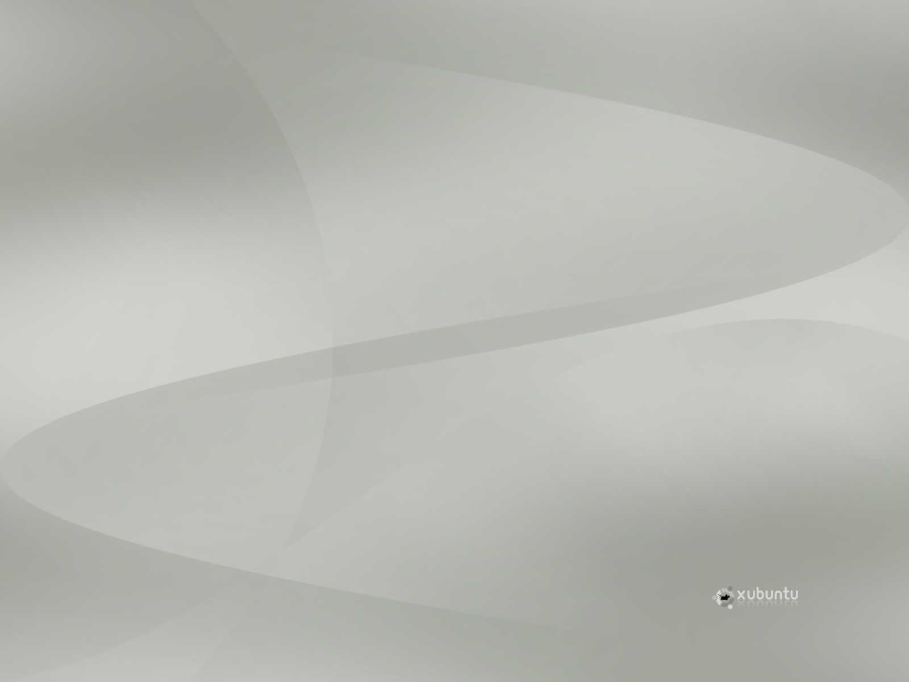

*Migrated from [Ubuntu Wiki](https://wiki.ubuntu.com/Xubuntu/Roadmap/Specifications/Dapper/Artwork/AluminiumProposal), last updated 2008-08-06.*

These artworks are based on Tango's aluminium color scheme.
Created by JozsefMak

# AluminiumLogo

# Wallpaper

# GDM login screen

# Usplash

