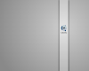
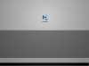
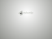

*Migrated from [Ubuntu Wiki](https://wiki.ubuntu.com/Xubuntu/Roadmap/Specifications/Dapper/Artwork/ColorScheme), last updated 2008-08-06.*

Currently we have 

- blue (usplash, logo)
- steel (gdm greeter)
- green (desktop background)
- tango aluminium
 
- brown (while gdm loads)

So unless there are other ideas these 3 colors are the porposed ones to participate in the poll. 
However to not only vote for an idea only we will need to have implemented (using those colors): 

- logo
- usplash
- gdm greeter 
- wallpaper 

 - Preferably being exaclty identical except the color shades themselves 
 - The wallpaper can have a transparent background 
 - It would be better to attach svg files too 
 - size small: 64x64 (#convert image.png -resize 64 image-small.png) 

| Name | Logo | | | Colors | Wallpaper | Gdm Greeter | Usplash |
|---|---|---|---|---|---|---|---|
| Current |   [view](xubuntulogo-current.png) | #AADEFF | #55BDFF | #0081D3 |   [view](xubuntu-wallpaper.png) |   [view](xubuntu-gdm.png) |   [view](xubuntu-gdm.png) |
| [Luzi](https://wiki.ubuntu.com/DapperXubuntLookProposalGray) |   [view](xubuntulogo-luzi.png) | #154374 | #a3C1C8 | #99A9C0 |   [view](xubuntu-wallpaper.png) |   [view](xubuntu-gdm.png) |   [view](xubuntu-usplash.png) |
| [JozsefMak_1](https://wiki.ubuntu.com/DapperXubuntLookProposalAluminium) |   [view](aluminium_logo.png) | #d3d7cf | #babdb6 | #888a85 |   [view](alu_wallpaper_small.png) |   [view](alu_login_small.png) |   [view](alu_usplash2.png) |
| [JozsefMak_2](https://wiki.ubuntu.com/DapperXubuntLookProposalSteel) |   [view](steel_logo.png) | #a0b7c9 | #3a5065 | #789abd |   [view](steel_wallpaper_small.png) |   [view](steel_login_small.png) |   [view](steel_usplash2.png) |
# Links

- [xubuntu-devel](https://lists.ubuntu.com/archives/xubuntu-devel/2006-April/000987.html): color theme poll, and decided artwork elements]
- [xfce images](http://xfce.org/various/xfce_images.tar.gz) which you can use in order to create Xfce-related artwork
