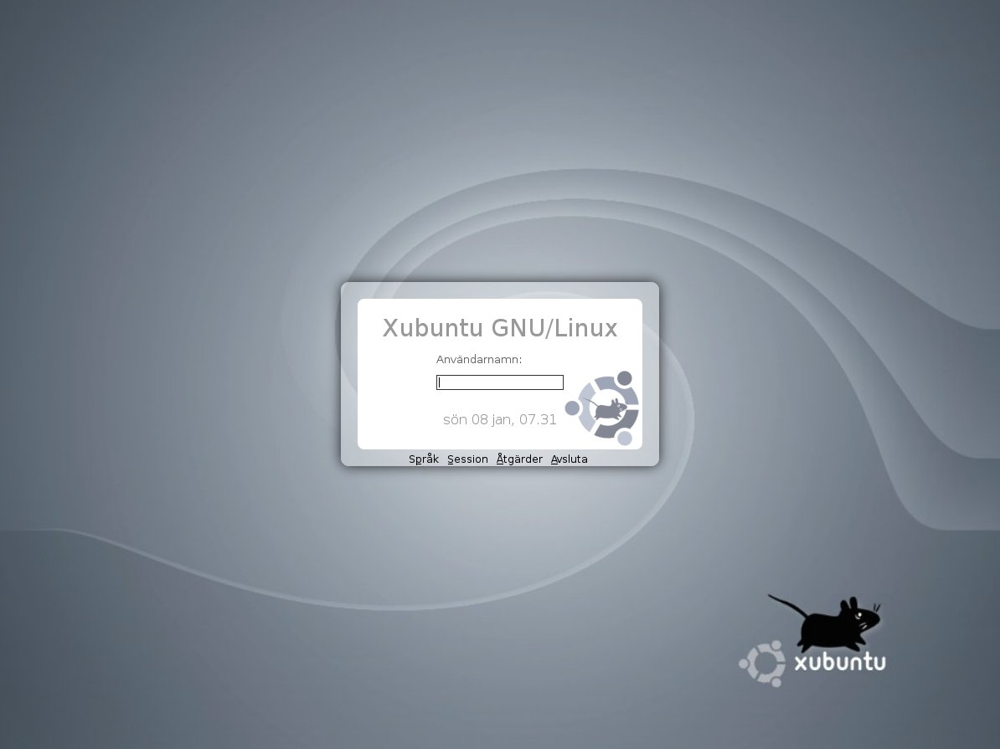

*Migrated from [Ubuntu Wiki](https://wiki.ubuntu.com/Xubuntu/Roadmap/Specifications/Dapper/Artwork/GDM), last updated 2008-08-06.*

*DapperXubuntuLook*

# Decided

# May also be shipped

this is Luzi's gdm theme, adapted to the new logo colors, and with some color adjustments.

[tar.gz archive](xubuntu-gdm.tar.gz)

## ???'s Usplash

A GDM Theme I made. ;)

[Xubuntu_v0.3.tar.gz](Xubuntu_v0.3.tar.gz)

### Comments
Nice, if you could just insert your name :D. I'll soon upload mine too if I find the time. -- VincentZekred
