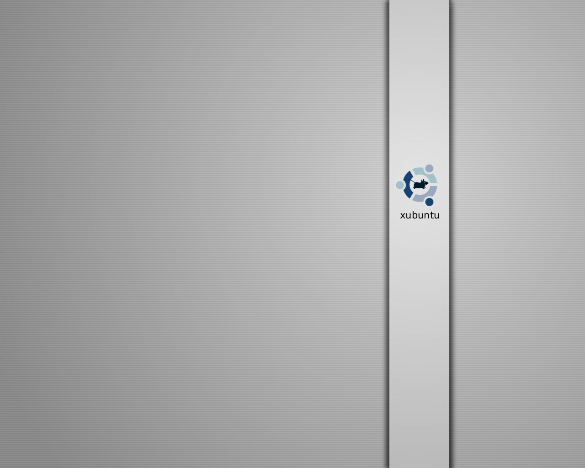
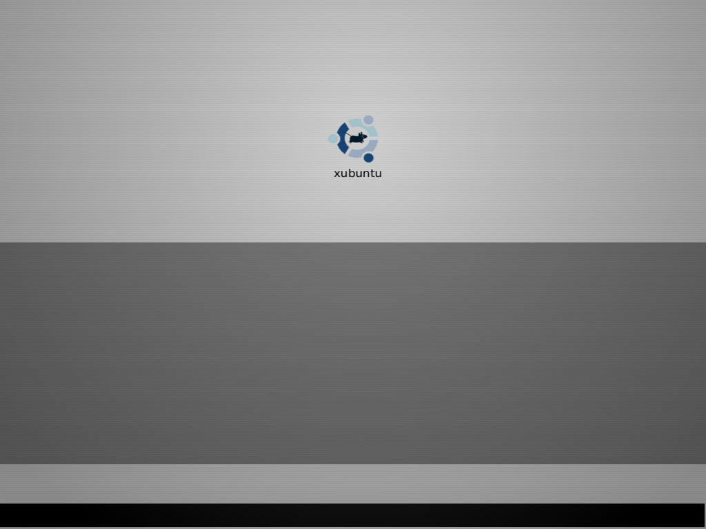

*Migrated from [Ubuntu Wiki](https://wiki.ubuntu.com/Xubuntu/Roadmap/Specifications/Dapper/Artwork/GrayProposal), last updated 2008-08-06.*

Proposal "Gray" by Luzi:

**<Warning>**

Now that the poll is over, updates to my proposals go directly to these pages:

DapperXubuntuLookDesktop

DapperXubuntuLookGdm

DapperXubuntuLookUsplash

This page is not updated anymore.

**</Warning>**

# Logo
 

[Inkscape Source](xubuntu_logo_blue.svg)

# Wallpaper

[XCF Source](xubuntu-wallpaper.xcf.gz)

# Usplash

I could not actually test this on my  system. I somehow failed at installing it properly :o( Maybe someone else can try it and tell me if it looks OK? I hope the font colors are OK.

# GDM Theme

[XCF Source](xubuntu-gdm.xcf.gz)

I'm just providing the background image at the moment. The theme as a whole, especially the color of the bar, would have to be slightly modified for this to work.
