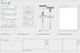

*Migrated from [Ubuntu Wiki](https://wiki.ubuntu.com/Xubuntu/Roadmap/Specifications/Dapper/Artwork/GtkTheme), last updated 2008-08-06.*

# Ubuntulooks-graphite

 [view large](xubuntulook-graphite.png)

- theme file: [gtkrc](graphite-gtkrc)
- gtk2 engine: [gtk2-engines-ubuntulooks]
- icon theme: [Tango-Aluminium](Tango-Aluminium.tar.gz)
# Theme 2

# Links

- [Ubuntulooks-graphite](http://www.gnome-look.org/content/show.php?content=36370)  
- [Ubuntulooks-graphite@ubuntu-art](https://lists.ubuntu.com/archives/ubuntu-art/2006-March/000746.html)
- [Tango-Aluminium@fred](http://www.mentalwarp.com/~fred/divers/ubuntu/Tango-Aluminium.tar.gz)
