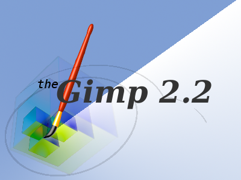

*Migrated from [Ubuntu Wiki](https://wiki.ubuntu.com/Xubuntu/Roadmap/Specifications/Feisty/Artwork/Incoming), last updated 2013-09-13.*

### Wallpaper and gdm login backround

Viper550:

### Glossy logo

### Usplash _640

### Usplash_800

### Usplash_1024

### Usplash_1365

### Throbber_back

### Throbber_fore
 

### Gimp splash

### Murrine theme
[murrine_clouds.tar.gz](murrine_clouds.tar.gz)
