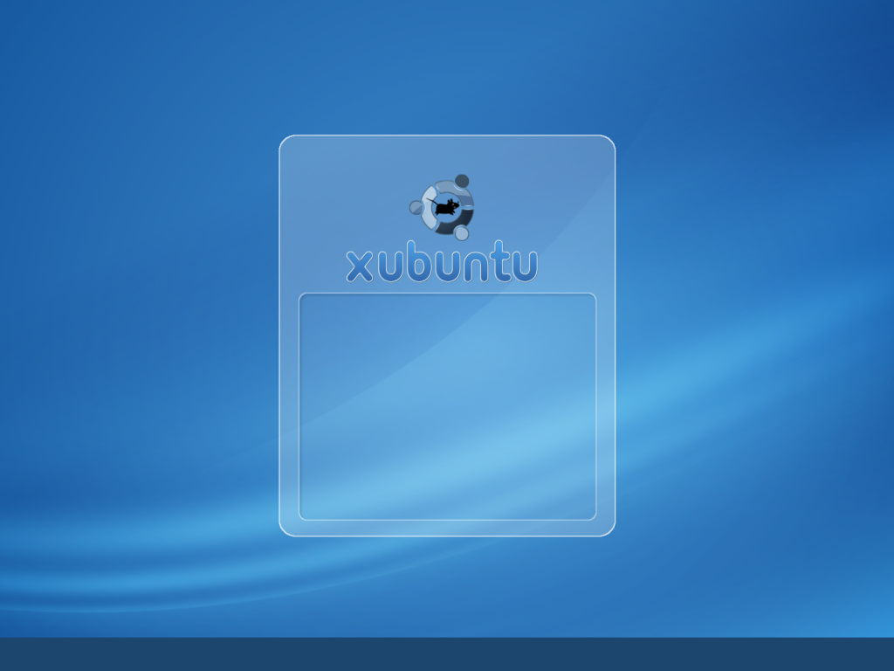

*Migrated from [Ubuntu Wiki](https://wiki.ubuntu.com/Xubuntu/Roadmap/Specifications/Gutsy/Artwork/AllImages), last updated 2012-03-25.*

### Wallpaper and GDM background

### GDM Login

### Usplash 640

### Usplash 800

### Usplash 1024

### Usplash 1365

### Throbber_fore

### Trobber_back

### Configuration file

[xubuntu_conf_xml.tar](xubuntu_conf_xml.tar)

# Mockups

### Usplash

### GDM Login

