*Migrated from [Ubuntu Wiki](https://wiki.ubuntu.com/Xubuntu/Roadmap/Specifications/Karmic/Artwork), last updated 2013-09-13.*

# Xubuntu Artwork for Karmic

This place contains previews of the artwork developed for Xubuntu 9.10 Karmic Koala, as well as links to access this artwork.

## GTK Themes

### Albatross

Albatross is a theme derived from Alvaro (made by James Schriver, who also made most of the changes that brought to Albatross) and intended to be used as a default theme for Xubuntu Karmic.
It uses dark grey panels, menus, window decorations and menu bars, with a light grey background and touches of light blue here and there. It is meant to be soft and yet to preserve a decent level of contrast.

[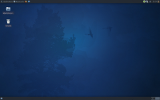](albatross_karmic_1.png) [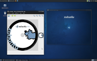](albatross_karmic_2.png) [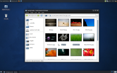](albatross_karmic_3.png) [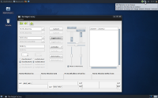](albatross_karmic_4.png) [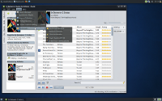](albatross_karmic_5.png)

*To get this theme: bzr branch lp:xubuntu-artwork*

### MurrinaXubuntu
MurrinaXubuntu is a dark theme created by Pasi Lallinaho. Click thumbnails for bigger images.

[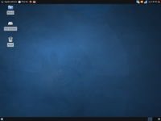](murrinaxubuntu_karmic_1.png) 
[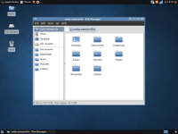](murrinaxubuntu_karmic_2.png) [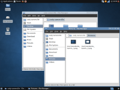](murrinaxubuntu_karmic_3.png)  [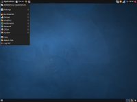](murrinaxubuntu_karmic_5.png)

*To get this theme: <http://emonk.fi/open/xubuntu/9.04%20Jaunty/GTK%20theme/MurrinaXubuntu-0.2.3.tar.gz*>

## Icon theme

### Elementary Xubuntu

It looks like we're going to be using the Elementary icon theme. It's beautiful, but there are a few icons here and there that we want to modify, for practical or æsthetical reasons. Here is a non exhaustive list:

| **Icons to change** |  | | |
|---|---|---|---|
| **Icon name / group** | **Reason for change** | **Asked by** | **Importance** |
| start-here | Obviously we want a mouse / xubuntu icon here | SiDi | High |
| ubiquity | Doesn't fit the rest, important because it's right on the desktop the first time a user boots Xubuntu. | VinNl | High |
| Terminal | That one looks very different depending on the size. Gnome-brave's one is slightly better ? The icon is too blurry on the window title bar. | SiDi + knome | High |
| media-* | <https://bugs.launchpad.net/elementaryicons/+bug/437588> | SiDi | High |
| media-playback-dynamic | This is a request for a new icon, for Exaile's dynamic mode | SiDi | High |
| Trash | Looks very plastic. Big preference for the gnome-brave / humanity ones but in blue | SiDi | High |
| preferences-desktop-theme | It looks weird. Not worse than many other icon themes, just weird | knome | High |
| stock_xfburn* | Some look outdated / pixellated, they MUST be redrawn | SiDi | High |
| input-keyboard | <https://bugs.launchpad.net/elementaryicons/+bug/433254> | SiDi | Avg |
| accessories-calculator | <https://bugs.launchpad.net/elementaryicons/+bug/434863> | SiDi | Avg |
| jockey-* | <https://bugs.launchpad.net/elementaryicons/+bug/433223> | SiDi | Low |
| mail-mark-junk | <https://bugs.launchpad.net/elementaryicons/+bug/433238> | SiDi | Low |
| openofficeorg3-* | <https://bugs.launchpad.net/elementaryicons/+bug/433249> | SiDi | Low |
| emblems | <https://bugs.launchpad.net/elementaryicons/+bug/442153> | SiDi | Low |
| applications-games | Doesn't look as beautiful as the others | knome* | Low |
| xfce4-mixer | It would be great to have an icon that looks more like a sound mixer | SiDi | Very Low |
| xfwm4 | This icon is quite impersonal too, can we make it look prettier ? | SiDi | Very Low |
| image-x | Maybe different images instead of plain PNG/JPG text when previsualisation isn't available | knome* | Very low |
| call-stop | Looks a bit too shiny, and is too much on the bottom of the square (would prefer a diagonal one like call-start) | SiDi | Done |
| notification-* | We want to use the Human ones since they're complete, sober and monochromatic | SiDi | Done |

*To get this theme: <http://danrabbit.deviantart.com/art/elementary-Icons-65437279*>

| **New icons** |  | | |
|---|---|---|---|
| **Name** | **Previous** | **New** | **Comment** |
| call-start |  |  | Shape stolen from gnome - gplv2 for now |
| call-stop |  |  | Shape stolen from gnome - gplv2 for now |

## Login Window

## Wallpaper

## Boot
### With a throbbler
**Normal screens**

 

[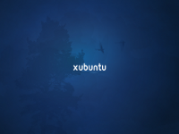](karmic-xsplash-03.png)

**Wide screens**

 

### With sparkles
**First Iteration**

[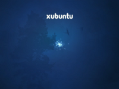](karmic-sparkles-01.ogv)

### LiveCD Usplash

[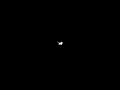](usplash_karmic_01.png)
