*Migrated from [Ubuntu Wiki](https://wiki.ubuntu.com/Xubuntu/Roadmap/Specifications/Trusty/CommunityWallpapers/Accepted), last updated 2014-01-17.*

# Accepted submissions for Xubuntu's 14.04 default wallpaper set

**Please do not edit this page.**

The wallpapers below have been found to conform with the guidelines and are hence accepted **as submissions** for the 14.04 wallpaper contest.

### Pastel
[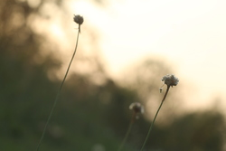](chenias_pastel.jpg)
  **Author:** Chenias 
  **License:** CC-BY-SA
  **Resolution:** 4272 × 2848
  **[Original Image](http://endorfinium.deviantart.com/art/PASTEL-414621006)**

### Squid during a night dive
[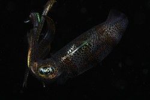](juergendonauer_squidduringanightdive.jpg)
  **Author:** Jürgen Donauer (bitblokes)
  **License:** CC-BY-SA
  **Resolution:** 5184 x 3456
  **[Original Image](http://www.free-underwater-photos.com/photo/268/squid-during-a-night-dive/)**

### Rain on the City
`Pixel Art, 3 Colors, Light` 

  **Author:** Yinon-David-Zadok
  **License:** CC-BY-SA
  **Resolution:** 2560 × 1600
  **[Original Image](http://i.imgur.com/QovR66h.png)** 

### The Pawn In The Distance
[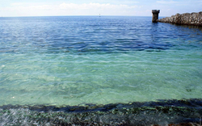](jonpaulraymond_thepawninthedistance.jpg)
  **Author:** Jon-Paul Raymond
  **License:** CC-BY-SA
  **Resolution:** 2559 × 1600
  **[Original Image](http://goo.gl/sESjGG)**

### That Memorable Day's End
[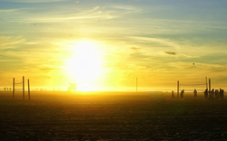](jonpaulraymond_thatmemorabledaysend.jpg)
  **Author:** Jon-Paul Raymond
  **License:** CC-BY-SA
  **Resolution:** 2560 × 1600
  **[Original Image](http://goo.gl/sESjGG)**

### As The Two Palms Watch
[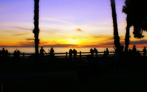](jonpaulraymond_asthetwopalmswatch.jpg)
  **Author:** Jon-Paul Raymond
  **License:** CC-BY-SA
  **Resolution:** 2560x1600
  **[Original Image](http://goo.gl/sESjGG)**

### Droplets
[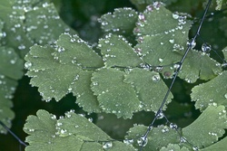](nathancampos_droplets.jpg)
  **Author:** Nathan Campos
  **License:** CC-BY-SA
  **Resolution:** 5184 x 3456
  **[Original Image](http://www.flickr.com/photos/nathanpc/8568652237/)**

### Moss
[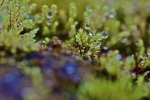](nathancampos_moss.jpg)
  **Author:** Nathan Campos
  **License:** CC-BY-SA
  **Resolution:** 5184 x 3456
  **[Original Image](http://www.flickr.com/photos/nathanpc/6827862038/)**

### Yellow Pygmy Seahorse
[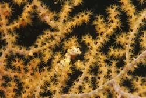](juergendonauer_yellowpygmyseahorse.jpg)
  **Author:** Jürgen Donauer (bitblokes)
  **License:** CC-BY-SA
  **Resolution:** 5184 x 3456
  **[Original Image](http://www.free-underwater-photos.com/photo/265/yellow-pygmy-seahorse/)**

### Diver and Light
[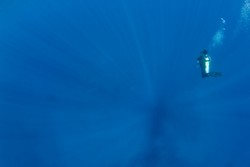](juergendonauer_diverandlight.jpg)
  **Author:** Jürgen Donauer (bitblokes)
  **License:** CC-BY-SA
  **Resolution:** 5184 x 3456
  **[Original Image](http://www.free-underwater-photos.com/photo/218/sunbeams-and-diver/)**

### Lady Bird
[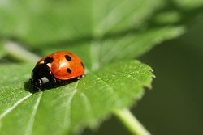](juergendonauer_ladybird.jpg)
  **Author:** Jürgen Donauer (bitblokes)
  **License:** CC-BY-SA
  **Resolution:** 5184 x 3456
  **[Original Image](http://www.free-underwater-photos.com/photo/242/macro-of-a-lady-bird/)**

### Walking Fisherman in the Sunset
[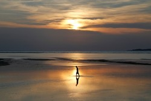](juergendonauer_walkingfishermaninthesunset.jpg)
  **Author:** Jürgen Donauer (bitblokes)
  **License:** CC-BY-SA
  **Resolution:** 5184 x 3456
  **[Original Image](http://www.free-underwater-photos.com/photo/167/fisherman-in-the-sunset/)**

### Oceanic White Tip Shark
[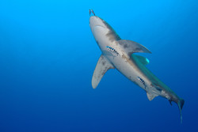](juergendonauer_oceanicwhitetipshark.jpg)
  **Author:** Jürgen Donauer (bitblokes)
  **License:** CC-BY-SA
  **Resolution:** 5184 x 3456
  **[Original Image](http://www.free-underwater-photos.com/photo/253/oceanic-whitetip-shark-(carcharhinus-longimanus)/)**

### Just For Two
[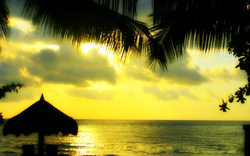](jonpaulraymond_justfortwo.jpg)
  **Author:** Jon-Paul Raymond
  **License:** CC-BY-SA
  **Resolution:** 2560 x 1600
  **[Original Image](http://goo.gl/sESjGG)**

### The Branch
[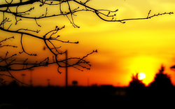](jonpaulraymond_thebranch.jpg)
  **Author:** Jon-Paul Raymond
  **License:** CC-BY-SA
  **Resolution:** 2560 x 1600
  **[Original Image](http://goo.gl/sESjGG)**

### The Way Home
[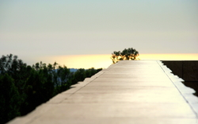](jonpaulraymond_thewayhome.jpg)
  **Author:** Jon-Paul Raymond
  **License:** CC-BY-SA
  **Resolution:** 2560 x 1600
  **[Original Image](http://goo.gl/sESjGG)**

### Jo-anah
[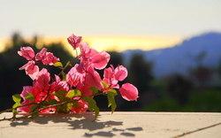](jonpaulraymond_joanah.jpg)
  **Author:** Jon-Paul Raymond
  **License:** CC-BY-SA
  **Resolution:** 2560 x 1600
  **[Original Image](http://goo.gl/sESjGG)**

### Red Pygmy Seahorse
[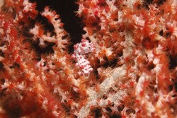](juergendonauer_redpygmyseahorse.jpg)
  **Author:** Jürgen Donauer (bitblokes)
  **License:** CC-BY-SA
  **Resolution:** 5184 x 3456
  **[Original Image](http://www.free-underwater-photos.com/photo/267/red-pygmy-seahorse/)** 

### Just Rocks
[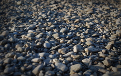](simonsteinbeiss_justrocks.jpg)
  **Author:** Simon Steinbeiß
  **License:** CC-BY-SA
  **Resolution:** 2560 x 1600

### Clouds
[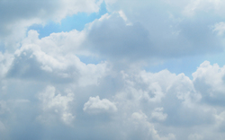](pasilallinaho_clouds.jpg)
  **Author:** Pasi Lallinaho
  **License:** CC-BY-SA
  **Resolution:** 2592 x 1620

### It Dreamed To Fly
[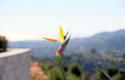](jonpaulraymond_itdreamedtofly.jpg)
  **Author:** Jon-Paul Raymond
  **License:** CC-BY-SA
  **Resolution:** 2560 x 1600
  **[Original Image](http://goo.gl/sESjGG)**

### The Knot
[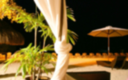](jonpaulraymond_theknot.jpg)
  **Author:** Jon-Paul Raymond
  **License:** CC-BY-SA
  **Resolution:** 2560 x 1600
  **[Original Image](http://goo.gl/sESjGG)**

### Duck Island Cottage
[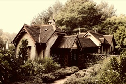](petermaloy_duckislandcottage.jpg)
  **Author:** Peter Maloy
  **License:** CC-BY-SA
  **Resolution:** 2560 x 1701

### Clover Field
[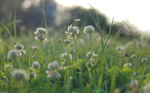](georgeckert_cloverfield.jpg)
  **Author:** Georg Eckert
  **License:** CC-BY-SA
  **Resolution:** 2560 x 1600
  **Contact:** gemlion [at] privatdemail [dot] net

### Blossoming
[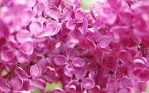](georgeckert_blossoming.jpg)
  **Author:** Georg Eckert
  **License:** CC-BY-SA
  **Resolution:** 2560 x 1600
  **Contact:** gemlion [at] privatdemail [dot] net

### Spring
[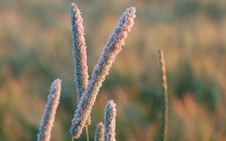](georgeckert_spring.jpg)
  **Author:** Georg Eckert
  **License:** CC-BY-SA
  **Resolution:** 2560 x 1600
  **Contact:** gemlion [at] privatdemail [dot] net

### White Flowers
[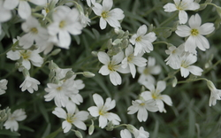](georgeckert_whiteflowers.jpg)
  **Author:** Georg Eckert
  **License:** CC-BY-SA
  **Resolution:** 2560 x 1600
  **Contact:** gemlion [at] privatdemail [dot] net

### Sky High
[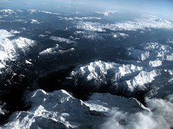](elisaperoni_skyhigh.jpg)
  **Author:** Elisa Peroni
  **License:** CC-BY-SA
  **Resolution:** 3205 x 2403
  **Contact:** peronielisa11 [at] gmail [dot] com

### Silence

  **Author:** Elisa Peroni
  **License:** CC-BY-SA
  **Resolution:** 3888 x 2592
  **Contact:** peronielisa11 [at] gmail [dot] com

### Summer View
[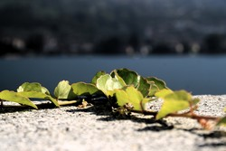](elisaperoni_summerview.jpg)
  **Author:** Elisa Peroni
  **License:** CC-BY-SA
  **Resolution:** 3827 x 2553
  **Contact:** peronielisa11 [at] gmail [dot] com

### Tarn
[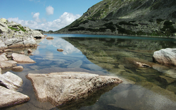](gaborszandi_tarn.jpg)
  **Author:** Gabor Szandi
  **License:** CC-BY-SA
  **Resolution:** 2560 x 1600
  **Contact:** sangleemester [at] gmail [dot] com

### Green Snake

  **Author:** Yinon-David-Zadok
  **License:** CC-BY-SA
  **Resolution:** 2560 × 1600

### Blueful

  **Author:** Yinon-David-Zadok
  **License:** CC-BY-SA
  **Resolution:** 2560 × 1600
  **[Original Image](http://imgur.com/a/NqzD6)**

### The Aging Sphere
[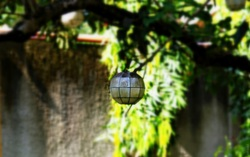](jonpaulraymond_theagingsphere.jpg)
  **Author:** Jon-Paul Raymond
  **License:** CC-BY-SA
  **Resolution:** 2560 × 1600
  **[Original Image](http://goo.gl/sESjGG)**

### Green Pit Viper
[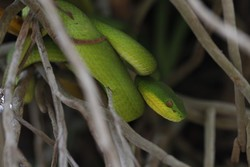](juergendonauer_greenpitviper.jpg)
  **Author:** Jürgen Donauer
  **License:** CC-BY-SA
  **Resolution:** 5184 x 3456
  **[Original Picture](http://www.free-underwater-photos.com/photo/269/green-pit-viper-(very-poisonous-snake)/)**

### Flower
[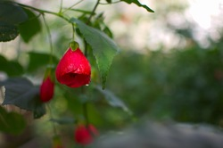](sebastiankacprzak_flower.jpg)
  **Author:** Sebastian Kacprzak
  **License:** CC-BY-SA
  **Resolution:** 4940 x 3272
  **[Original Picture](https://plus.google.com/photos/100147104412340662455/albums/5651549722270255601/5803336086670647634?pid=5803336086670647634)**

### Random Friends
[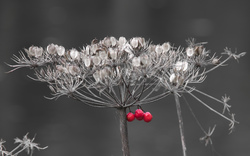](michalpredotka_randomfriends.jpg)
  **Author:** Michał Prędotka
  **License:** CC-BY-SA
  **Resolution:** 2560 x 1600

### Tenerife from the air
[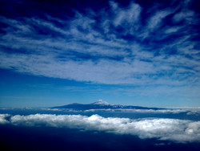](alfonsoaguirrearbex_tenerifefromtheair.jpg)
  **Author:** Alfonso Aguirre Arbex
  **License:** CC-BY-SA
  **Resolution:** 2592 x 1952

### Traslasierra

  **Author:** Adrian Felipe Pera
  **License:** CC-BY-SA
  **Resolution:** 2880 x 1800

### Flower
[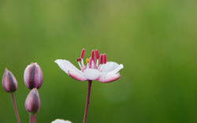](bertbeentjes_flower.jpg)
  **Author:** Bert Beentjes
  **License:** CC-BY-SA
  **Resolution:** 2560 x 1600

### Sky
[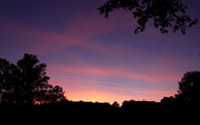](bertbeentjes_sky.jpg)
  **Author:** Bert Beentjes
  **License:** CC-BY-SA
  **Resolution:** 2560 x 1600

### Water
[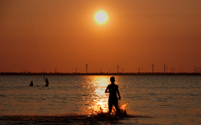](bertbeentjes_water.jpg)
  **Author:** Bert Beentjes
  **License:** CC-BY-SA
  **Resolution:** 2560 x 1600

### Common Eland
[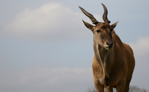](opencage_commoneland.jpg)
  **Author:** !OpenCage
  **License:** CC-BY-SA
  **Resolution:** 2560 x 1600

### The Narrows
[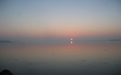](charlespattison_thenarrows.jpg)
  **Author:** Charles Pattison
  **License:** CC-BY-SA
  **Resolution:** 2560 x 1600

### Cloud Breaker
[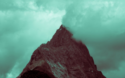](kaydendmello_cloudbreaker.jpg)
  **Author:** Kayden D'Mello
  **License:** CC-BY-SA
  **Resolution:** 2560 x 1600

### Distant Mountains

  **Author:** Kayden D'Mello
  **License:** CC-BY-SA
  **Resolution:** 2560 x 1600

### Southern Alps
[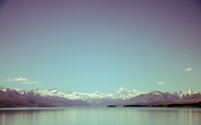](kaydendmello_southernalps.jpg)
  **Author:** Kayden D'Mello
  **License:** CC-BY-SA
  **Resolution:** 2560 x 1600

### Winter
[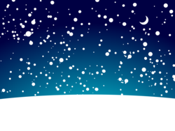](georgeckert_winter.png)
  **Author:** Georg Eckert (gemlion [at] privatdemail [dot] net) [Original SVG](http://ubuntuone.com/0fFYN0ftoz15AS9CwsPn5I)
  **License:** CC-BY-SA
  **Resolution:** 1600x1200, scalable

### Nebula
[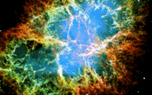](georgeckert_nebula.png)
  **Author:** Georg Eckert (gemlion [at] privatdemail [dot] net) Original SVG attached
  **License:** CC-BY-SA
  **Resolution:** 2560x1600, scalable
  **Source:** Made from a [NASA Hubble Photo](http://moinmo.in/), See [NASA Usage Guidelines](http://www.nasa.gov/audience/formedia/features/MP_Photo_Guidelines.html#.Up2awsNVE2p)

### Balance

  **Author:** Gavin Ash
  **License:** CC-BY-SA
  **Resolution:** 5618x3512

### Funk
[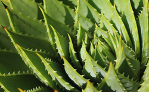](gavinash_funk.jpg)
  **Author:** Gavin Ash
  **License:** CC-BY-SA
  **Resolution:** 2560x1600

### On The Rocks
[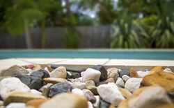](gavinash_ontherocks.jpg)
  **Author:** Gavin Ash
  **License:** CC-BY-SA
  **Resolution:** 5720x3575

### Red Moon
[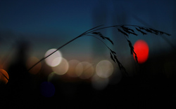](gavinash_redmoon.jpg)
  **Author:** Gavin Ash
  **License:** CC-BY-SA
  **Resolution:** 2560x1600

### Solitude
[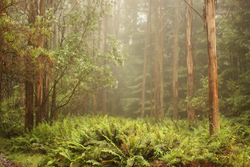](gavinash_solitude.jpg)
  **Author:** Gavin Ash
  **License:** CC-BY-SA
  **Resolution:** 5184x3456

### Standard

  **Author:** [Nyanagharo](https://wiki.ubuntu.com/nyanagharo)
  **License:** CC-BY-SA
  **Resolution:** 2560 x 1600
  **[Original Image](http://www.deviantart.com/art/Nyanagharo-Standard-419521072)**

### Dirty Water

  **Author:** ObrienDave Original Artwork
  **License:** CC-BY-SA
  **Resolution:** 2560 x 1600

### Snowstorm
[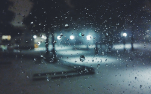](hund_snowstorm.jpg)
  **Author:** [Hund](https://wiki.ubuntu.com/hund)
  **License:** CC-BY-SA
  **Resolution:** 2560 x 1600

### GuitarCityByNight
[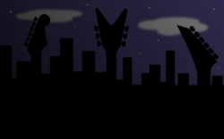](breek_guitarcitybynight.png)
  **Author:** breek
  **License:** CC-BY-SA
  **Resolution:** 2560 x 1600
  **[Original Image](http://breek.deviantart.com/art/guitar-city-by-night-287504667)**

### LonelyTree
[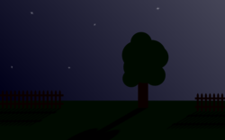](breek_lonelytree.png)
  **Author:** breek
  **License:** CC-BY-SA
  **Resolution:** 2560 x 1600
  **[Original Image](http://breek.deviantart.com/art/lonely-tree-348698022)**

### Snowy Forest

  **Author:** Leaf Watoru
  **License:** CC-BY-SA
  **Resolution:** 3072 x 2304

### The Gravel Road

  **Author:** Kyle Fazzari
  **License:** CC-BY-SA
  **Resolution:** 2560 x 1600

### Abandoned

  **Author:** Kyle Fazzari
  **License:** CC-BY-SA
  **Resolution:** 2560 x 1600

### Fire In The Sky

  **Author:** Kyle Fazzari
  **License:** CC-BY-SA
  **Resolution:** 2560 x 1600

### Holiday

  **Author:** Kyle Fazzari
  **License:** CC-BY-SA
  **Resolution:** 2560 x 1600

### Smoke

  **Author:** ObrienDave Original Artwork
  **License:** CC-BY-SA
  **Resolution:** 2560 x 1600

### Pixelit

  **Author:** Vellu Salmela
  **License:** CC-BY-SA
  **Resolution:** 2560 x 1600

### Bubbles

  **Author:** Francisco Villarroel
  **License:** CC-BY-SA
  **Resolution:** 2560 x 1440

### Lavender

  **Author:** Francisco Villarroel
  **License:** CC-BY-SA
  **Resolution:** 2560 x 1440

### Light

  **Author:** Francisco Villarroel
  **License:** CC-BY-SA
  **Resolution:** 2560 x 1440

### Solitude

  **Author:** Francisco Villarroel
  **License:** CC-BY-SA
  **Resolution:** 2560 x 1440

### Sunrise

  **Author:** Francisco Villarroel
  **License:** CC-BY-SA
  **Resolution:** 2560 x 1440

### Beach of a far land

  **Author:** Satyajit Sahoo
  **License:** CC-BY-SA
  **Resolution:** 2560 x 1600

### Black Manta

  **Author:** Juergen Donauer
  **License:** CC-BY-SA
  **Resolution:** 5184 x 3456
  **Original Image:** <http://www.free-underwater-photos.com/photo/270/black-manta-ray/>

### The Dark Side

  **Author:** ArunasRV
  **License:** CC-BY-SA
  **Resolution:** 2560 x 1600

### The Bright Side

  **Author:** ArunasRV
  **License:** CC-BY-SA
  **Resolution:** 2560 x 1600

### Diffusion

  **Author:** ArunasRV
  **License:** CC-BY-SA
  **Resolution:** 2560 x 1600

### Macro shot of a sea urchin

  **Author:** Juergen Donauer
  **License:** CC-BY-SA
  **Resolution:** 5184 x 3456
  **Original Image:** <http://www.free-underwater-photos.com/photo/271/macro-shot-of-a-sea-urchin/>

### BlueMacedonia

  **Author:** Nenad Latinović
  **License:** CC-BY-SA
  **Resolution:** 2560 x 1600

### Cabo

  **Author:** Nenad Latinović
  **License:** CC-BY-SA
  **Resolution:** 2560 x 1600

### Matosinhos Sea

  **Author:** Nenad Latinović
  **License:** CC-BY-SA
  **Resolution:** 2560 x 1600

### Porto

  **Author:** Nenad Latinović
  **License:** CC-BY-SA
  **Resolution:** 2560 x 1600
